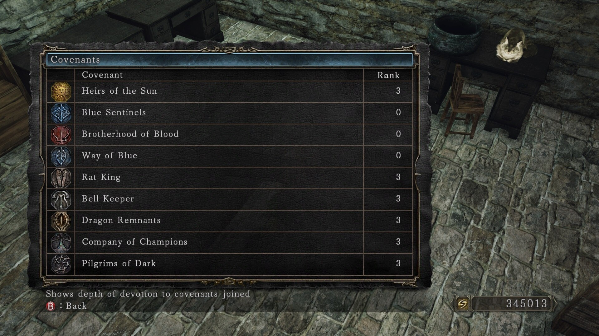

# What's next?

Congratulations! You have made it so far and finished your first playthrough. Is
there any replay value in the game? Yes, there is. Here are some ideas.

-   Farm covenant items and obtain as many covenant rewards as possible without
    PvP. You can rank up in the following covenants without ever having to
    engage in PvP: Heirs of the Sun, Rat King, Bell Keeper, Dragon Remnants,
    Company of Champions, Pilgrims of Dark, Way of Blue.

    

-   Obtain all Steam achievements. This requires you to play through at least
    NG+2.

-   Challenge runs. The usual challenge run is an SL1 run where you remain at
    soul level 1 throughout the whole playthrough and never levelling up. You
    are allowed to upgrade your weapons and armour pieces. Summon NPCs to help
    you fight a boss, but for extra challenge you should solo each boss.

    

-   Gouda run. Cheese as many bosses as you can.

    

-   Pacifist run. You are not allowed to attack any boss. Any damage done to a
    boss must be by an NPC summon. The boss can take damage from the
    environment, be killed by gravity, or die to a glitch.

    https://www.youtube.com/playlist?list=PLFO2sz-beHWdOjjrG6WtHexoxQ2YsDUQR

-   No death, no bonfire. This run requires you to complete the game by
    defeating as few bosses as possible. Throughout the whole run, your
    character must not die and you are not allowed to rest at a bonfire. Using a
    Primal Bonfire is OK because a Primal Bonfire takes you back to Majula and
    doesn't restore your Estus Flask. Successfully complete the run and you
    would be rewarded with the Illusory Ring of the Exalted and the Illusory
    Ring of a Conqueror.

    {% youtube id="HoaIJDIkkhk", title="[World's First] Dark Souls 2: SotFS Any% No Bonfire No Hit Run" %}

-   PvP. Be careful to limit your soul memory in one way or another. Obtain the
    Agape Ring as soon as possible to help with your PvP build. Use
    [soulsplanner](https://soulsplanner.com) to help you create a build. See
    this page for more details:

    https://mpql.net/tools/dark-souls-2/

-   The game can be as challenging as you make it. Try to limit yourself in some
    way during a playthrough.
